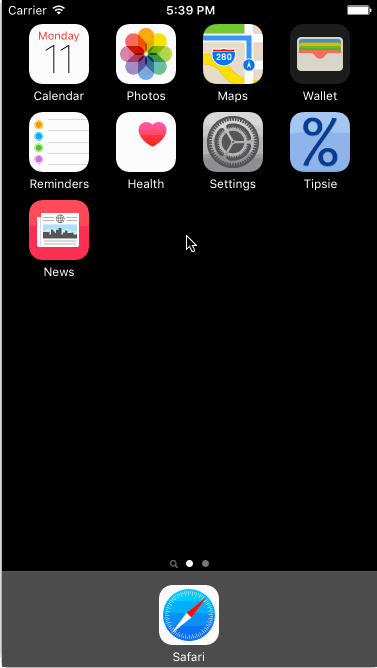

# Tipsie

This is a Tip Calculator application for iOS submitted as the [pre-assignment](http://courses.codepath.com/snippets/intro_to_ios/thanks_for_applying#heading-prework) requirement for CodePath.

Time spent: 18 hours

### Completed:

* [x] Required: User can enter a bill amount, choose a tip percentage, and see the tip and total values.
* [x] Required: Settings page to change the default tip percentage.
* [x] Optional: UI animations
* [x] Optional: Remembering the bill amount across app restarts (if < 5 mins).
* [x] Optional: Using locale-specific currency and currency thousands separators.
* [x] Optional: Make sure the keyboard is always visible and the bill amount is always the first responder. Keyboard can be dismissed if the user taps away from UITextView. This way the user can see per-person bill totals.
* [x] Additional: Light/Dark theming of app including Settings page.
* [x] Additional: Saving the theme choice across app restarts.
* [x] Additional: Change keyboard appearance based on theme.
* [x] Additional: Display per-person bill totals in a UITableView on main page.
* [x] Additional: Use Auto Layout to ensure that the app looks good on all recent iPhones (4s and up).
* [x] Additional: Ensure main UI controls visible without dismissing keyboard on iPhone 4s.

### Notes:

When dealing with currency it is preferred to use NSDecimalNumber, but I am just using Doubles and string formatting (likely okay given the limited functionality).

I abstracted much of the tip functionality out into a Tips struct. One of the benefits is that the tip percentages and tip display values can easily be changed throughout the app from one place.

I abstracted out the theme functionality which makes it easy to change the colors of the themes. Currently the app has two themes, but you could add additional themes with minimal work.

The Xcode files are in the Tipsie directory.

I've included the Sketch.app files I created when tweaking the design. Those are in the Design directory.

No third-party libraries used.

### Walk-Through Videos:

I've included 2 walk-through videos to show the Auto Layout working on different sized devices.

GIF created with [LiceCap](http://www.cockos.com/licecap/).
