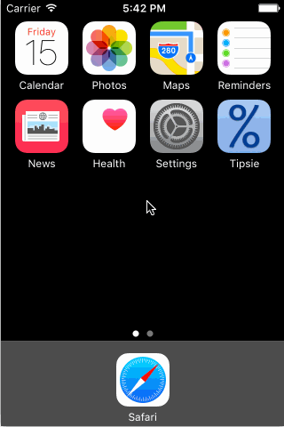

# Tipsie

This is a Tip Calculator application for iOS submitted as the [pre-assignment](http://courses.codepath.com/snippets/intro_to_ios/thanks_for_applying#heading-prework) requirement for CodePath.

Time spent: 18 hours

Completed:

* [x] Required: User can enter a bill amount, choose a tip percentage, and see the tip and total values.
* [x] Required: Settings page to change the default tip percentage.
* [x] Optional: Remembering the bill amount across app restarts (if < 5 mins).
* [x] Optional: Using locale-specific currency and currency thousands separators.
* [x] Optional: Make sure the keyboard is always visible and the bill amount is always the first responder. Keyboard is dismissable if user taps away from UITextView. This way the user can see per person bill totals.
* [x] Additional: Light/Dark theming of app including Setting page.
* [x] Additional: Saving the theme choice across app restarts.
* [x] Additional: Change keyboard appearance based on theme.
* [x] Additional: Display per person bill totals in a UITableView on main page.
* [x] Additional: Use Auto Layout to ensure that the app looks good on all recent iPhones (4s and up).
* [x] Additional: Ensure main UI controls visible without dismissing keyboard on iPhone 4s.

Notes: I really wanted to make the layout look decent on the newer, wider iPhones, so I decided to implement Auto Layout instead of the optional UI animations. I would have liked to do both, but I understand that getting Auto Layout and UI animations to play well together is tricky. I also understand that using NSDecimalNumber is prefered when dealing with currency, but I am just using Doubles and string formatting.

GIF created with [LiceCap](http://www.cockos.com/licecap/).
